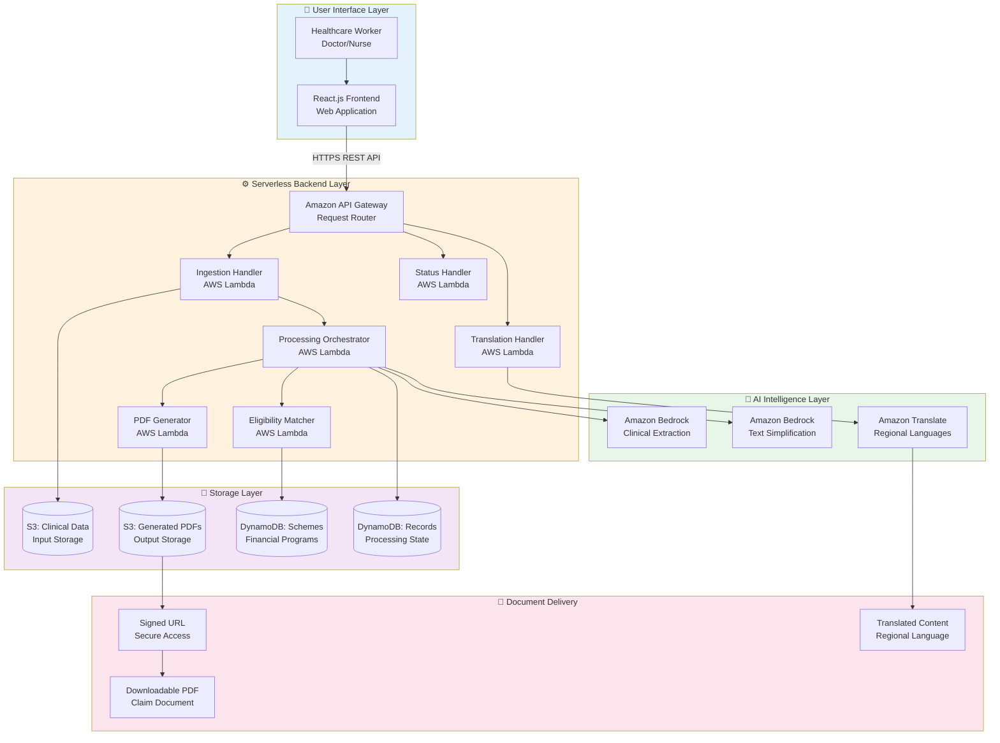
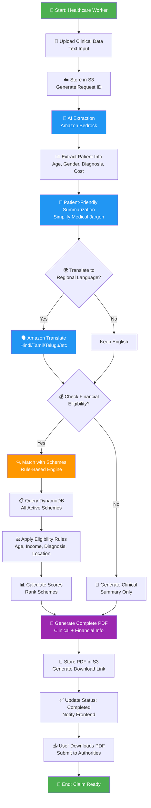

# Design Document

## Project Title
From Diagnosis to Financial Support: An AI Workflow Copilot for Rural Healthcare

---

## 1. System Overview

### Purpose
Automate the workflow from clinical diagnosis documentation to financial assistance claim preparation for rural healthcare facilities using AI-powered extraction, simplification, translation, and eligibility matching.

### Key Objectives
- Transform unstructured clinical notes into structured data
- Simplify medical jargon for patient understanding
- Translate to regional languages
- Match patients with eligible financial schemes
- Generate claim-ready PDF documents

### Target Users
- **Primary**: Doctors, Nurses, Healthcare Workers
- **Secondary**: Patients and their families
- **Tertiary**: Hospital administrators

---

## 2. System Architecture

### 2.1 Architecture Overview

The system follows a serverless, event-driven architecture with four main layers:

1. **User Interface Layer**: Web-based frontend for healthcare workers
2. **API Gateway Layer**: Entry point for all client requests
3. **Serverless Backend Layer**: AWS Lambda functions for processing
4. **AI Intelligence Layer**: Amazon Bedrock and Translate for AI capabilities
5. **Storage & Delivery Layer**: S3 for data storage and PDF delivery

### 2.2 Detailed Architecture Diagram

### 2.3 Component Descriptions

#### User Interface Layer
- **Healthcare Worker**: Primary user who uploads clinical data
- **React.js Frontend**: Simple web application with upload, status tracking, and results display

#### API Gateway Layer
- **Amazon API Gateway**: Single entry point for all API requests
  - Routes requests to appropriate Lambda functions
  - Handles authentication and rate limiting
  - Manages CORS for web access

#### Serverless Backend Layer
- **Ingestion Handler Lambda**: Receives clinical data, stores in S3, initiates processing
- **Processing Orchestrator Lambda**: Coordinates AI extraction, simplification, and eligibility matching
- **Eligibility Matcher Lambda**: Applies rule-based logic to match schemes
- **PDF Generator Lambda**: Creates downloadable claim assistance PDF
- **Translation Handler Lambda**: Translates content to regional languages
- **Status Handler Lambda**: Returns processing status to frontend

#### Storage Layer
- **S3 Clinical Data Bucket**: Stores uploaded clinical text files
- **S3 PDF Bucket**: Stores generated PDF documents
- **DynamoDB Schemes Table**: Contains financial assistance scheme information
- **DynamoDB Records Table**: Tracks processing status and results

#### AI Intelligence Layer
- **Amazon Bedrock (Extraction)**: Extracts structured data from clinical notes
- **Amazon Bedrock (Simplification)**: Converts medical jargon to simple language
- **Amazon Translate**: Translates to Hindi, Tamil, Telugu, Bengali, Marathi, Gujarati

#### Document Delivery
- **Signed URLs**: Secure, time-limited access to PDFs
- **Downloadable PDF**: Complete claim assistance document
- **Translated Content**: Regional language explanations

---

## 3. Data Flow & Processing Logic

### 3.1 Complete Workflow Flowchart

### 3.2 Step-by-Step Processing Flow

#### Phase 1: Data Ingestion (1-2 seconds)
1. Healthcare worker enters clinical text in frontend
2. Frontend sends POST request to API Gateway `/api/upload`
3. Ingestion Handler Lambda:
   - Validates input
   - Generates unique request_id (UUID)
   - Stores clinical text in S3 bucket
   - Creates DynamoDB record with status='processing'
   - Triggers Processing Orchestrator asynchronously
4. Returns request_id to frontend for tracking

#### Phase 2: AI Extraction (5-8 seconds)
1. Processing Orchestrator retrieves clinical text from S3
2. Calls Amazon Bedrock with extraction prompt
3. Bedrock analyzes text and extracts:
   - Patient demographics (age, gender)
   - Primary and secondary diagnoses
   - Symptoms and medical history
   - Treatment plan and medications
   - Estimated treatment cost
   - Urgency level
4. Returns structured JSON data
5. Stores extracted data in DynamoDB

#### Phase 3: Text Simplification (3-5 seconds)
1. Processing Orchestrator sends extracted data to Bedrock
2. Bedrock generates patient-friendly explanation:
   - Removes medical jargon
   - Uses simple, clear language
   - Maintains medical accuracy
   - Empathetic tone
3. Returns simplified explanation text
4. Stores in DynamoDB

#### Phase 4: Financial Eligibility Matching (2-3 seconds)
1. Processing Orchestrator invokes Eligibility Matcher Lambda
2. Eligibility Matcher queries DynamoDB schemes-table
3. For each active scheme, applies rule-based logic:
   - **Age Criteria**: Check if patient age falls within scheme range
   - **Income Criteria**: Verify income eligibility (if data available)
   - **Diagnosis Coverage**: Match diagnosis against covered conditions
   - **Geographic Eligibility**: Check state/district eligibility
   - **Treatment Cost**: Verify cost falls within coverage limits
4. Calculates eligibility score (0-100%) for each scheme
5. Filters schemes with score ≥ 50%
6. Ranks schemes by score (highest first)
7. Returns matched schemes array with:
   - Scheme name and type
   - Eligibility score and reasons
   - Coverage amount
   - Application process
   - Required documents
8. Stores matched schemes in DynamoDB

#### Phase 5: PDF Generation (5-8 seconds)
1. Processing Orchestrator triggers PDF Generator Lambda
2. PDF Generator retrieves complete data from DynamoDB
3. Formats PDF with sections:
   - **Header**: Patient ID, date, facility info
   - **Patient Information**: Demographics
   - **Clinical Summary**: Diagnosis and treatment (medical terms)
   - **Simplified Explanation**: Patient-friendly version
   - **Eligible Schemes**: List with details and scores
   - **Required Documents**: Checklist for applications
   - **Contact Information**: Scheme helplines and websites
4. Generates PDF using ReportLab library
5. Uploads PDF to S3 bucket
6. Generates signed URL (valid for 7 days)
7. Updates DynamoDB with pdf_url and status='completed'

#### Phase 6: Results Delivery (< 1 second)
1. Frontend polls `/api/status/{request_id}` every 2 seconds
2. Status Handler Lambda queries DynamoDB
3. When status='completed', returns:
   - Extracted patient data
   - Simplified explanation
   - Matched schemes list
   - PDF download URL
4. Frontend displays results dashboard
5. User can download PDF immediately

#### Phase 7: Optional Translation (2-3 seconds)
1. User selects regional language from dropdown
2. Frontend sends POST to `/api/translate`
3. Translation Handler Lambda calls Amazon Translate
4. Translates simplified explanation to target language
5. Returns translated text
6. Frontend displays translated content

### 3.3 Processing Timeline

| Phase | Duration | Type |
|-------|----------|------|
| Data Ingestion | 1-2 sec | Synchronous |
| AI Extraction | 5-8 sec | Asynchronous |
| Text Simplification | 3-5 sec | Asynchronous |
| Eligibility Matching | 2-3 sec | Asynchronous |
| PDF Generation | 5-8 sec | Asynchronous |
| Results Delivery | <1 sec | Synchronous |
| Translation (optional) | 2-3 sec | On-demand |

**Total Processing Time**: 20-30 seconds

---

## 4. Component Integration & Communication

### 4.1 Frontend ↔ API Gateway
- **Protocol**: HTTPS REST API
- **Data Format**: JSON
- **Authentication**: API Key or AWS Cognito
- **Endpoints**:
  - `POST /api/upload` - Upload clinical data
  - `GET /api/status/{request_id}` - Check processing status
  - `POST /api/translate` - Translate content
  - `GET /api/pdf/{request_id}` - Download PDF

### 4.2 API Gateway ↔ Lambda Functions
- **Integration**: Lambda Proxy Integration
- **Invocation Types**:
  - Synchronous: API endpoints (upload, status, translate)
  - Asynchronous: Background processing (orchestrator, PDF generator)
- **Timeout**: 29 seconds for API Gateway

### 4.3 Lambda ↔ S3
- **SDK**: AWS boto3 (Python)
- **Operations**:
  - PUT: Upload clinical text and PDFs
  - GET: Retrieve clinical text for processing
  - Generate signed URLs for secure PDF access
- **Security**: IAM roles with least privilege

### 4.4 Lambda ↔ DynamoDB
- **SDK**: AWS boto3
- **Operations**:
  - PutItem: Create new records
  - GetItem: Retrieve by request_id or scheme_id
  - UpdateItem: Update processing status
  - Query: Search using GSIs
  - Scan: Retrieve all schemes
- **Consistency**: Eventually consistent reads

### 4.5 Lambda ↔ Amazon Bedrock
- **SDK**: boto3 bedrock-runtime client
- **API**: InvokeModel
- **Model**: Claude 3 Sonnet (anthropic.claude-3-sonnet-20240229-v1:0)
- **Process**:
  1. Construct prompt with clinical text
  2. Call invoke_model() with model ID
  3. Parse JSON response
  4. Validate and store results

### 4.6 Lambda ↔ Amazon Translate
- **SDK**: boto3 translate client
- **API**: TranslateText
- **Languages**: en → hi, ta, te, bn, mr, gu
- **Limit**: 10,000 characters per request

---

## 5. Database Design

### 5.1 DynamoDB: patient-records-table

**Purpose**: Track processing workflow and store results

**Schema**:
- **Primary Key**: `request_id` (String)
- **Attributes**:
  - `status`: "processing" | "completed" | "failed"
  - `created_at`: ISO 8601 timestamp
  - `updated_at`: ISO 8601 timestamp
  - `clinical_text_s3_key`: S3 object reference
  - `extracted_data`: Map (age, gender, diagnosis, treatment, cost)
  - `simplified_explanation`: String
  - `matched_schemes`: List of Maps (scheme details)
  - `pdf_s3_key`: String
  - `pdf_url`: String
  - `error_message`: String (if failed)

**Global Secondary Index**:
- `status-created_at-index`: Query records by status

**Capacity**: On-Demand mode

### 5.2 DynamoDB: schemes-table

**Purpose**: Store financial assistance scheme information

**Schema**:
- **Primary Key**: `scheme_id` (String)
- **Attributes**:
  - `scheme_name`: String
  - `scheme_type`: "Central Government" | "State Government" | "NGO" | "Private"
  - `description`: String
  - `coverage_amount`: Number (INR)
  - `criteria`: Map (age_range, max_income, covered_diagnoses, eligible_states)
  - `application_process`: String
  - `required_documents`: List of Strings
  - `contact_info`: Map (website, helpline, email)
  - `active`: Boolean
  - `last_updated`: ISO 8601 timestamp

**Global Secondary Indexes**:
- `scheme_type-index`: Filter by type
- `active-index`: Query active schemes only

**Sample Schemes**:
1. Pradhan Mantri Jan Arogya Yojana (PM-JAY)
2. State-specific schemes (e.g., Karnataka Arogya Bhagya)
3. NGO schemes (e.g., Tata Memorial Hospital)
4. Private foundation schemes

---

## 6. Security Architecture

### 6.1 Data Encryption
- **At Rest**: S3 (SSE-S3), DynamoDB (default encryption), Lambda env vars (KMS)
- **In Transit**: HTTPS/TLS 1.2+ for all communications

### 6.2 Access Control
- **IAM Roles**: Each Lambda has dedicated role with least privilege
- **S3 Bucket Policies**: Private buckets, Lambda-only access
- **API Gateway**: API keys or Cognito authentication

### 6.3 Data Privacy
- **Prototype**: Use only synthetic/anonymized data
- **Retention**: Clinical data (30 days), PDFs (90 days)
- **Audit**: CloudTrail for API calls, CloudWatch for logs

---

## 7. Scalability & Performance

### 7.1 Scalability
- **Lambda**: Auto-scales to 1000 concurrent executions
- **DynamoDB**: On-Demand mode auto-scales
- **S3**: Inherently scalable
- **API Gateway**: Handles high request volumes

### 7.2 Performance Optimizations
- Lambda Layers for shared dependencies
- Connection pooling for DynamoDB
- Cache scheme data in Lambda memory (1-hour TTL)
- Asynchronous processing for long-running tasks

### 7.3 Monitoring
- **CloudWatch Metrics**: Lambda invocations, API latency, DynamoDB usage
- **CloudWatch Logs**: Execution logs for debugging
- **Alarms**: Error rates, latency thresholds, cost alerts

---

## 8. Cost Estimation

### Monthly Cost (Prototype - 1000 requests)

| Service | Usage | Cost |
|---------|-------|------|
| Lambda | 6,000 invocations, 512MB | $0.20 |
| S3 | 10 GB storage, 2,000 requests | $0.50 |
| DynamoDB | On-Demand, 10K reads, 2K writes | $0.50 |
| Bedrock | 200K tokens (Claude Sonnet) | $6.00 |
| Translate | 200K characters | $3.00 |
| API Gateway | 2,000 requests | $0.07 |
| **Total** | | **~$10.27/month** |

---

## 9. Future Enhancements

### Phase 2 (3-6 months)
- **Multi-Modal Input**: Forms, Excel upload, OCR for prescriptions
- **Voice Input**: Amazon Transcribe Medical integration
- **Mobile App**: React Native for field workers
- **HMS Integration**: HL7/FHIR standard support

### Phase 3 (6-12 months)
- **Patient Portal**: Self-service for patients
- **Analytics Dashboard**: Usage statistics and insights
- **ML Models**: Custom models for improved matching
- **Real-time Notifications**: SNS/SES integration

---

## 10. Assumptions & Limitations

### Assumptions
1. Rural facilities have basic internet (2+ Mbps)
2. Clinical notes are in English
3. Scheme data is manually maintained
4. Prototype uses synthetic data only

### Limitations
1. **AI Accuracy**: Requires human review for critical decisions
2. **Text-Only**: Phase 1 supports text upload only
3. **Rule-Based**: Cannot handle complex eligibility logic
4. **Processing Time**: 20-30 seconds (not for emergencies)
5. **No Direct Submission**: PDF generation only, manual submission required

---

## 11. Success Metrics

### Key Performance Indicators
- Processing success rate: >95%
- Average processing time: <30 seconds
- System uptime: >99.5%
- Scheme match accuracy: >80%
- User satisfaction: >4/5
- Time saved per patient: >80% reduction

---

## Conclusion

This design provides a serverless, AI-powered architecture for automating healthcare financial assistance workflows. The system leverages AWS managed services for scalability and cost-effectiveness while providing robust AI capabilities through Amazon Bedrock and Translate.

**Key Strengths**:
- Serverless architecture with automatic scaling
- AI-powered extraction and simplification
- Multi-language support for accessibility
- Comprehensive PDF generation
- Cost-effective pay-per-use model

**Next Steps**:
1. Set up AWS environment
2. Implement Lambda functions
3. Integrate Bedrock and Translate
4. Build React frontend
5. Populate scheme database
6. Test with synthetic data

---

**Document Version**: 1.0  
**Last Updated**: February 15, 2026  
**Status**: Design Document for Prototype Implementation
