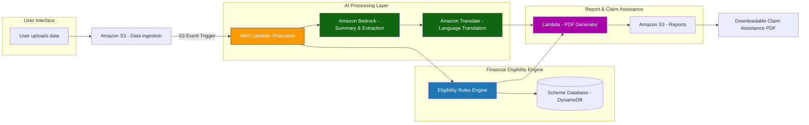
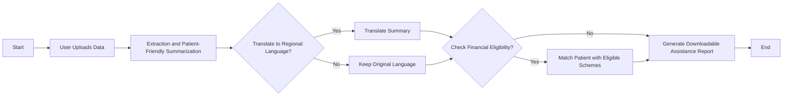

# Design Document

## Project Title
From Diagnosis to Financial Support: An AI Workflow Copilot for Rural Healthcare

---

## 1. System Overview

### Purpose
Automate the workflow from clinical diagnosis to financial assistance claim preparation using AI-powered extraction, simplification, translation, and financial eligibility matching.

---

## 2. System Architecture

### Architecture Diagram

## 3. Data Flow & Processing Logic

### Workflow Flowchart

## 4. Technology Stack

| Layer | Technology | Purpose |
|-------|-----------|---------|
| Frontend | React.js | User interface |
| API Gateway | AWS API Gateway | Request routing |
| Compute | AWS Lambda | Serverless functions |
| Storage | Amazon S3 | File storage |
| Database | Amazon DynamoDB | NoSQL database |
| AI - Extraction | Amazon Bedrock | Clinical data processing |
| AI - Translation | Amazon Translate | Language translation |
| PDF Generation | ReportLab (Python) | PDF creation |

---

## 5. Workflow design logic

Extraction: Structured data extracted from raw doctor notes via Amazon Bedrock.

Simplify & Translate: Turn jargon into simple understandable language and also translate into regional languages if required.

Match Financial Shemes: Rule-based engine maps patient profile to gov and non-gov schemes for financial aid.

Generate: One-click claim-ready PDF.

**Document Version**: 1.0  
**Last Updated**: February 15, 2026  
**Status**: Design Document for Prototype Implementation
