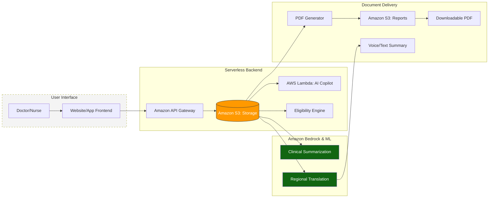
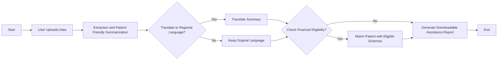

# Design Document

## Project Title
From Diagnosis to Financial Support: An AI Workflow Copilot for Rural Healthcare

---

## 1. System Overview

### Purpose
Automate the workflow from clinical diagnosis to financial assistance claim preparation using AI-powered extraction, simplification, translation, and eligibility matching.

### Key Objectives
- Transform unstructured clinical notes into structured data
- Simplify medical jargon for patient understanding
- Translate to regional languages (Hindi, Tamil, Telugu, Bengali, Marathi, Gujarati)
- Match patients with eligible financial schemes
- Generate claim-ready PDF documents

### Target Users
- **Primary**: Doctors, Nurses, Healthcare Workers
- **Secondary**: Patients and their families

---

## 2. System Architecture

### Architecture Diagram

### Component Descriptions

**User Interface Layer**
- React.js web application for healthcare workers
- Simple upload interface, status tracking, results display

**Amazon API Gateway**
- Single entry point for all API requests
- Handles authentication, rate limiting, and CORS

**Serverless Backend**
- **Amazon S3 Storage**: Stores clinical data (input) and generated PDFs (output)
- **AWS Lambda AI Copilot**: Orchestrates entire processing workflow
- **Eligibility Engine**: Rule-based matching logic for financial schemes

**AI Intelligence (Amazon Bedrock & ML)**
- **Clinical Summarization**: Extracts structured data from unstructured clinical notes
- **Regional Translation**: Translates simplified explanations to regional languages using Amazon Translate

**Document Delivery**
- **PDF Generator**: Creates comprehensive claim assistance documents
- **Amazon S3 Reports**: Stores generated PDFs with secure access
- **Downloadable PDF**: Final output for claim submission

---

## 3. Data Flow & Processing Logic

### Workflow Flowchart

### Step-by-Step Processing

**Step 1: Data Upload (1-2 seconds)**
- Healthcare worker enters clinical text in frontend
- Frontend sends POST to `/api/upload`
- Lambda generates unique request_id
- Stores clinical text in S3
- Creates DynamoDB record with status='processing'
- Returns request_id to frontend

**Step 2: AI Extraction (5-8 seconds)**
- Lambda retrieves clinical text from S3
- Calls Amazon Bedrock for data extraction
- Extracts: patient age, gender, diagnosis, treatment plan, estimated cost
- Returns structured JSON data
- Stores extracted data in DynamoDB

**Step 3: Patient-Friendly Summarization (3-5 seconds)**
- Lambda sends extracted data to Amazon Bedrock
- Bedrock generates simplified explanation in plain language
- Removes medical jargon while maintaining accuracy
- Stores simplified explanation in DynamoDB

**Step 4: Regional Translation (Optional, 2-3 seconds)**
- User selects target language (Hindi, Tamil, Telugu, etc.)
- Lambda calls Amazon Translate
- Translates simplified explanation to regional language
- Returns translated text to frontend

**Step 5: Financial Eligibility Matching (2-3 seconds)**
- Lambda queries DynamoDB schemes-table for all active schemes
- Applies rule-based matching logic:
  - Age criteria
  - Income eligibility
  - Diagnosis coverage
  - Geographic location
  - Treatment cost coverage
- Calculates eligibility score (0-100%) for each scheme
- Filters schemes with score ≥ 50%
- Ranks schemes by score
- Returns matched schemes with details

**Step 6: PDF Generation (5-8 seconds)**
- Lambda retrieves all processed data from DynamoDB
- Formats PDF with sections:
  - Patient information
  - Clinical summary
  - Simplified explanation
  - Eligible schemes with details
  - Required documents checklist
  - Contact information
- Generates PDF using ReportLab
- Uploads to S3 Reports bucket
- Updates DynamoDB with pdf_url and status='completed'

**Step 7: Results Delivery (<1 second)**
- Frontend polls `/api/status/{request_id}` every 2 seconds
- When status='completed', displays results dashboard
- User downloads PDF via signed S3 URL

**Total Processing Time**: 20-30 seconds

---

## 4. Database Design

### DynamoDB: patient-records-table
- **Primary Key**: request_id (String)
- **Attributes**: status, created_at, clinical_text_s3_key, extracted_data, simplified_explanation, matched_schemes, pdf_url
- **GSI**: status-created_at-index

### DynamoDB: schemes-table
- **Primary Key**: scheme_id (String)
- **Attributes**: scheme_name, scheme_type, coverage_amount, criteria (age_range, max_income, covered_diagnoses, eligible_states), application_process, required_documents, contact_info, active
- **GSI**: scheme_type-index, active-index

**Sample Schemes**:
1. Pradhan Mantri Jan Arogya Yojana (PM-JAY)
2. State-specific schemes (Karnataka Arogya Bhagya)
3. NGO schemes (Tata Memorial Hospital)
4. Private foundation schemes

---

## 5. API Design

### Endpoints

**POST /api/upload**
- Upload clinical data
- Returns: { request_id, status: "processing" }

**GET /api/status/{request_id}**
- Check processing status
- Returns: { status, extracted_data, simplified_explanation, matched_schemes, pdf_url }

**POST /api/translate**
- Translate content to regional language
- Request: { text, target_language }
- Returns: { translated_text }

**GET /api/pdf/{request_id}**
- Download generated PDF
- Returns: Signed S3 URL or PDF binary

---

## 6. Technology Stack

| Layer | Technology | Purpose |
|-------|-----------|---------|
| Frontend | React.js | User interface |
| API Gateway | AWS API Gateway | Request routing |
| Compute | AWS Lambda | Serverless functions |
| Storage | Amazon S3 | File storage |
| Database | Amazon DynamoDB | NoSQL database |
| AI - Extraction | Amazon Bedrock | Clinical data processing |
| AI - Translation | Amazon Translate | Language translation |
| PDF Generation | ReportLab (Python) | PDF creation |

---

## 7. Security & Scalability

### Security
- **Encryption**: S3 (SSE-S3), DynamoDB (default), HTTPS/TLS 1.2+
- **Access Control**: IAM roles with least privilege, private S3 buckets
- **Data Privacy**: Use synthetic data for prototype, 30-day retention for clinical data, 90-day for PDFs
- **Authentication**: API keys or AWS Cognito

### Scalability
- **Lambda**: Auto-scales to 1000 concurrent executions
- **DynamoDB**: On-Demand mode auto-scales
- **S3**: Inherently scalable
- **Optimizations**: Lambda Layers, connection pooling, cache scheme data (1-hour TTL)

### Monitoring
- CloudWatch Metrics: Lambda invocations, API latency, DynamoDB usage
- CloudWatch Logs: Execution logs
- Alarms: Error rates, latency thresholds

---

## 8. Cost Estimation

### Monthly Cost (1000 requests)

| Service | Usage | Cost |
|---------|-------|------|
| Lambda | 6,000 invocations, 512MB | $0.20 |
| S3 | 10 GB storage, 2,000 requests | $0.50 |
| DynamoDB | On-Demand, 10K reads, 2K writes | $0.50 |
| Bedrock | 200K tokens (Claude Sonnet) | $6.00 |
| Translate | 200K characters | $3.00 |
| API Gateway | 2,000 requests | $0.07 |
| **Total** | | **~$10.27/month** |

---

## 9. Future Enhancements

### Phase 2 (3-6 months)
- Multi-modal input: Forms, Excel upload, OCR for prescriptions (Amazon Textract)
- Voice input: Amazon Transcribe Medical
- Mobile app: React Native for field workers
- HMS integration: HL7/FHIR standards

### Phase 3 (6-12 months)
- Patient self-service portal
- Analytics dashboard for administrators
- Custom ML models for improved matching
- Real-time notifications (SNS/SES)
- Chatbot for scheme guidance

---

## 10. Assumptions & Limitations

### Assumptions
- Rural facilities have basic internet (2+ Mbps)
- Clinical notes are in English
- Scheme data is manually maintained
- Prototype uses synthetic data only

### Limitations
- AI accuracy requires human review for critical decisions
- Phase 1 supports text upload only (no forms/files)
- Rule-based matching cannot handle complex eligibility logic
- Processing time: 20-30 seconds (not for emergencies)
- No direct submission to scheme portals (PDF generation only)

---

## 11. Success Metrics

- Processing success rate: >95%
- Average processing time: <30 seconds
- System uptime: >99.5%
- Scheme match accuracy: >80%
- User satisfaction: >4/5
- Time saved per patient: >80% reduction

---

## Conclusion

This serverless, AI-powered architecture automates healthcare financial assistance workflows using AWS managed services. The system provides scalability, cost-effectiveness, and robust AI capabilities through Amazon Bedrock and Translate.

**Next Steps**:
1. Set up AWS environment (S3, DynamoDB, Lambda, API Gateway)
2. Implement Lambda functions for orchestration
3. Integrate Amazon Bedrock and Translate
4. Build React frontend
5. Populate schemes database
6. Test with synthetic data
7. Prepare demonstration

---

**Document Version**: 1.0  
**Last Updated**: February 15, 2026  
**Status**: Design Document for Prototype Implementation
